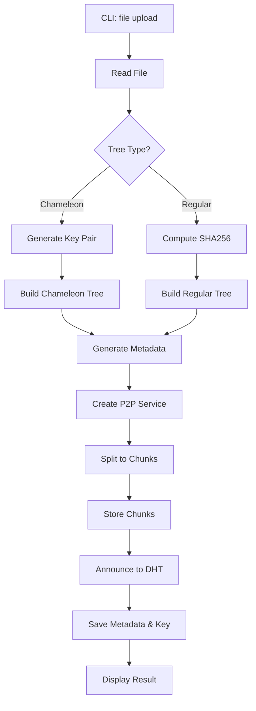
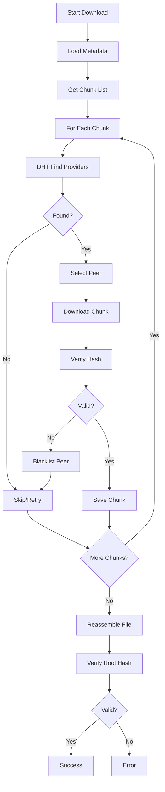

# 核心架构解析

## 架构图

### 系统分层架构

```
┌─────────────────────────────────────────────────────────────────┐
│                   Interface / Presentation Layer                │
│  ┌──────────────┐  ┌──────────────┐  ┌──────────────┐         │
│  │   cmd/p2p    │  │  cmd/api     │  │  Future GUI  │         │
│  │  (CLI Tool)  │  │ (HTTP Server)│  │   (Optional) │         │
│  └──────────────┘  └──────────────┘  └──────────────┘         │
│      CLI Commands      REST API Endpoints                     │
└───────────────────────────┬─────────────────────────────────────┘
                            │
┌───────────────────────────▼─────────────────────────────────────┐
│                        Core Layer                               │
│  ┌───────────────────────────────────────────────────────────┐  │
│  │                    pkg/p2p/ (Core)                        │  │
│  │  ┌─────────┐ ┌─────────┐ ┌─────────┐ ┌─────────┐         │  │
│  │  │   DHT   │ │ Chunk   │ │  File   │ │  Conn   │         │  │
│  │  │ Router  │ │ Transfer│ │ Manager │ │ Manager │         │  │
│  │  └─────────┘ └─────────┘ └─────────┘ └─────────┘         │  │
│  └───────────────────────────────────────────────────────────┘  │
└───────────────────────────┬─────────────────────────────────────┘
                            │
┌───────────────────────────▼─────────────────────────────────────┐
│                    Algorithm Layer                               │
│  ┌─────────────────────┐  ┌─────────────────────┐              │
│  │  Chameleon Merkle   │  │   Regular Merkle    │              │
│  │       Tree          │  │       Tree          │              │
│  │  (Elliptic P256)    │  │    (SHA256)         │              │
│  └─────────────────────┘  └─────────────────────┘              │
└───────────────────────────┬─────────────────────────────────────┘
                            │
┌───────────────────────────▼─────────────────────────────────────┐
│                      Infrastructure Layer                        │
│  ┌─────────┐  ┌─────────┐  ┌─────────┐  ┌─────────┐           │
│  │ libp2p  │ │   DHT   │ │  Config │ │  File   │           │
│  │ Network │ │ (Kadem) │ │ Manager │ │  System │           │
│  └─────────┘  └─────────┘  └─────────┘  └─────────┘           │
└─────────────────────────────────────────────────────────────────┘
```

### 核心组件交互图

```
┌─────────────┐
│   CLI Cmd   │
└──────┬──────┘
       │ 1. Create Service
       ▼
┌─────────────────────────────────────────────────────────────┐
│                     P2PService                               │
│  ┌──────────┐  ┌──────────┐  ┌──────────┐  ┌──────────┐   │
│  │   Host   │ │    DHT   │ │ PeerSel  │ │AntiLeech │   │
│  │ (libp2p) │ │ (Kadem.) │ │          │ │          │   │
│  └──────────┘  └──────────┘  └──────────┘  └──────────┘   │
│  ┌──────────────────────────────────────────────────┐      │
│  │              ConnManager                          │      │
│  │  ┌────────┐  ┌────────┐  ┌────────┐             │      │
│  │  │Blacklst│  │Metrics │  │ Limits │             │      │
│  │  └────────┘  └────────┘  └────────┘             │      │
│  └──────────────────────────────────────────────────┘      │
└─────────────────────────────────────────────────────────────┘
       │                    │                    │
       │ 2. Announce        │ 3. Lookup          │ 4. Transfer
       ▼                    ▼                    ▼
┌──────────┐         ┌──────────┐         ┌──────────┐
│   DHT    │         │   DHT    │         │  Chunk   │
│Provider  │         │Provider  │         │ Transfer │
└──────────┘         └──────────┘         └──────────┘
       │                    │
       └──────────┬─────────┘
                  ▼
         ┌────────────────┐
         │   Peer Network │
         │  (P2P Nodes)   │
         └────────────────┘
```

### 文件上传流程图



### 文件下载流程图



## 设计模式

### 1. 工厂模式 (Factory Pattern)

**应用位置**: `pkg/p2p/p2p.go`

```go
// 工厂函数：创建 P2PService 实例
func NewP2PService(ctx context.Context, config P2PConfig) (*P2PService, error) {
    // 创建 Host
    host, err := newBasicHost(config.Port, config.Insecure, config.Seed)
    // 创建 DHT
    kdht, err := newDHT(ctx, host, config)
    // 组装完整服务
    return &P2PService{...}, nil
}
```

**优势**:
- 封装复杂的创建逻辑
- 统一的初始化流程
- 易于扩展和测试

### 2. 策略模式 (Strategy Pattern)

**应用位置**: `pkg/p2p/peerSelector.go`

```go
// 策略接口
type PeerSelector interface {
    SelectPeer(peers []peer.ID) peer.ID
}

// 具体策略1：随机选择
type RandomPeerSelector struct{}
func (r *RandomPeerSelector) SelectPeer(peers []peer.ID) peer.ID {
    // 随机选择逻辑
}

// 具体策略2：轮询选择
type RoundRobinPeerSelector struct {
    index int
}
func (r *RoundRobinPeerSelector) SelectPeer(peers []peer.ID) peer.ID {
    // 轮询选择逻辑
}
```

**优势**:
- 运行时切换算法
- 易于添加新策略
- 算法解耦

### 3. 适配器模式 (Adapter Pattern)

**应用位置**: `pkg/file/fsAdapter.go`

```go
// 适配器接口
type FileSystemAdapter interface {
    ReadFile(path string) ([]byte, error)
    WriteFile(path string, data []byte) error
}

// 本地文件系统适配器
type LocalFileSystemAdapter struct{}
func (LocalFileSystemAdapter) ReadFile(path string) ([]byte, error) {
    return os.ReadFile(path)
}
```

**优势**:
- 统一文件系统访问接口
- 易于切换存储后端（如 S3、IPFS）
- 便于单元测试

### 4. 单例模式 (Singleton Pattern)

**应用位置**: `pkg/p2p/connManager.go`

```go
// 连接管理器实例（每个 P2PService 一个）
type ConnManager struct {
    peerStats map[peer.ID]*PeerStats
    blacklist map[peer.ID]time.Time
    mutex     sync.RWMutex
}

// 服务内部管理唯一实例
type P2PService struct {
    ConnManager *ConnManager  // 单例
    // ...
}
```

**优势**:
- 集中管理连接状态
- 避免竞态条件
- 资源共享

### 5. 观察者模式 (Observer Pattern)

**应用位置**: 进度回调机制

```go
// 进度回调函数类型
type ProgressCallback func(current, total int)

// 文件上传时使用
func uploadFile(progress ProgressCallback) {
    for i, chunk := range chunks {
        // 上传分块
        uploadChunk(chunk)
        // 通知观察者
        if progress != nil {
            progress(i+1, len(chunks))
        }
    }
}
```

**优势**:
- 解耦进度显示逻辑
- 支持多个监听器
- 异步通知机制

### 6. 构建器模式 (Builder Pattern)

**应用位置**: 配置构建

```go
// 配置结构
type P2PConfig struct {
    Port              int
    Insecure          bool
    ChunkStoragePath  string
    // ...
}

// 提供默认配置的构建器
func NewP2PConfig() P2PConfig {
    return P2PConfig{
        Port:             0,
        Insecure:         false,
        ChunkStoragePath: "files",
        // ...
    }
}

// 链式调用修改
config := p2p.NewP2PConfig()
config.MaxConcurrency = 32
config.RequestTimeout = 10
```

**优势**:
- 分步骤构建复杂对象
- 提供合理默认值
- 清晰的配置语义

### 7. 模板方法模式 (Template Method Pattern)

**应用位置**: `cmd/p2p/file/upload.go`

```go
// 模板方法：上传流程
func uploadFile(ctx context.Context, filePath string) error {
    // 1. 验证参数
    if err := validateParams(); err != nil {
        return err
    }

    // 2. 打开文件
    f, err := os.Open(filePath)
    defer f.Close()

    // 3. 选择树类型（具体实现由子方法决定）
    if treeType == "chameleon" {
        return uploadFileChameleon(ctx, f)
    }
    return uploadFileRegular(ctx, f)
}

// 具体实现1：Chameleon 上传
func uploadFileChameleon(ctx context.Context, f *os.File) error {
    // 特定于 Chameleon 的实现
}

// 具体实现2：Regular 上传
func uploadFileRegular(ctx context.Context, f *os.File) error {
    // 特定于 Regular 的实现
}
```

**优势**:
- 定义算法骨架
- 子类可变部分
- 代码复用

## 架构风格

### 1. 分层架构 (Layered Architecture)

系统采用经典的三层架构：

- **表示层 (Presentation Layer)**:
  - `cmd/p2p/` - CLI 工具
  - `cmd/api/` - HTTP REST API 服务器
  - 提供多种访问接口
- **业务逻辑层 (Business Logic Layer)**: `pkg/p2p/`, `pkg/chameleonMerkleTree/` - 核心功能
- **基础设施层 (Infrastructure Layer)**: libp2p, 文件系统, 配置管理

**优势**:
- 清晰的职责划分
- 易于维护和测试
- 层间松耦合

### 2. 模块化架构 (Modular Architecture)

每个包 (`pkg/`) 都是独立模块：

```
pkg/
├── p2p/                     # P2P 网络模块
├── chameleonMerkleTree/     # Merkle 树模块
├── config/                  # 配置模块
└── file/                    # 文件处理模块
```

**模块间依赖规则**:
- ✅ 上层模块可以依赖下层模块
- ✅ 同层模块间最小依赖
- ❌ 下层模块不能依赖上层模块

**依赖图**:
```
cmd/p2p ──┬──> pkg/p2p ──┬──> pkg/file
           │              └──> pkg/chameleonMerkleTree
           └──> pkg/config
```

### 3. 事件驱动架构 (Event-Driven Architecture)

DHT 操作采用事件驱动：

```go
// 注册事件处理器
p.AnnounceHandler(ctx)        // 处理公告事件
p.LookupHandler(ctx)          // 处理查询事件
p.RegisterChunkExistHandler(ctx)   // 处理存在性查询
p.RegisterChunkDataHandler(ctx)    // 处理数据获取
```

**优势**:
- 异步处理
- 解耦请求和响应
- 支持并发操作

## 数据流分析

### 1. 文件上传数据流

```
[用户文件]
    │
    ▼
[文件读取] (os.Open)
    │
    ▼
[分块处理] (CalculateChunkHashes)
    │
    ├─> [Chunk 1] ─> SHA256 ─> Hash1
    ├─> [Chunk 2] ─> SHA256 ─> Hash2
    └─> [Chunk N] ─> SHA256 ─> HashN
    │
    ▼
[Merkle Tree 构建]
    │
    ├─> Chameleon: Hashes ─> ECDSA ─> RootHash
    └─> Regular: Hashes ─> SHA256 ─> RootHash
    │
    ▼
[生成 Metadata]
    │
    ├─> RootHash
    ├─> ChunkList
    ├─> FileSize
    └─> PublicKey (Chameleon)
    │
    ▼
[存储 Chunks]
    │
    ├─> files/{hash1}
    ├─> files/{hash2}
    └─> files/{hashN}
    │
    ▼
[DHT 公告]
    │
    ├─> Announce Hash1 ─> DHT
    ├─> Announce Hash2 ─> DHT
    └─> Announce HashN ─> DHT
    │
    ▼
[保存 Metadata]
    │
    ├─> metadata/{rootHash}.json
    └─> metadata/{rootHash}.key (Chameleon)
    │
    ▼
[完成]
```

### 2. 文件下载数据流

```
[Metadata]
    │
    ▼
[解析 ChunkList]
    │
    ▼
[For Each Chunk]:
    │
    ├─> [DHT.FindProviders]
    │       │
    │       ▼
    │   [Provider List]
    │       │
    │       ▼
    │   [PeerSelector.Select]
    │       │
    │       ▼
    │   [Selected Peer]
    │       │
    │       ▼
    │   [Request Chunk]
    │       │
    │       ▼
    │   [Receive Data]
    │       │
    │       ▼
    │   [Verify SHA256]
    │       │
    │       ├─> Valid ─> [Save Chunk]
    │       └─> Invalid ─> [Blacklist Peer] ─> [Retry]
    │
    ▼
[所有 Chunk 完成后]
    │
    ▼
[重组文件]
    │
    ▼
[验证 RootHash]
    │
    ├─> Valid ─> [成功]
    └─> Invalid ─> [失败]
```

### 3. DHT 操作数据流

```
[客户端请求]
    │
    ▼
[Protocol Handler]
    │
    ├─> /p2p-file-transfer/announce
    ├─> /p2p-file-transfer/lookup
    ├─> /p2p-file-transfer/chunk-exist
    └─> /p2p-file-transfer/chunk-data
    │
    ▼
[DHT Provider]
    │
    ├─> PutValue(key, value)     ─> Kademlia DHT
    ├─> GetValue(key)            ─> Kademlia DHT
    ├─> FindProviders(key)       ─> Kademlia DHT
    └─> Provide(key)             ─> Kademlia DHT
    │
    ▼
[网络传输]
    │
    ▼
[Peer Response]
    │
    ▼
[结果返回]
```

### 4. 组件间通信机制

#### 4.1 同步通信（函数调用）

```go
// P2PService 内部组件通信
service := p2p.NewP2PService(ctx, config)

// 直接调用
providers := service.FindProviders(ctx, chunkHash)
peer := service.PeerSelector.SelectPeer(providers)
data := service.GetChunkData(ctx, peer, chunkHash)
```

#### 4.2 异步通信（Channel）

```go
// 并发下载使用 Channel 通信
type ChunkResult struct {
    Index int
    Data  []byte
    Error error
}

results := make(chan ChunkResult, len(chunks))

// 启动多个 goroutine
for i := 0; i < config.MaxConcurrency; i++ {
    go downloadWorker(ctx, chunkQueue, results)
}

// 收集结果
for range chunks {
    result := <-results
    // 处理结果
}
```

#### 4.3 事件通信（Protocol Handler）

```go
// 注册协议处理器
host.SetStreamHandler(protocol, func(s network.Stream) {
    // 处理传入请求
    handleRequest(s)
})

// 主动发起连接
stream, err := host.NewStream(ctx, peer, protocol)
// 发送请求
writeRequest(stream)
// 读取响应
readResponse(stream)
```

## 关键决策点

### 1. 为什么选择 libp2p？

**原因**:
- ✅ 成熟的 P2P 网络库，IPFS 的核心
- ✅ 支持多种传输协议（TCP, WebSocket, QUIC）
- ✅ 内置 NAT 穿透
- ✅ 活跃的社区和持续的维护
- ✅ 跨平台支持

**权衡**:
- ❌ 学习曲线较陡
- ❌ 文档相对分散
- ❌ 某些功能需要深度定制

**替代方案**:
- **Go-BitTorrent**: 更简单，但功能有限
- **自建 P2P 框架**: 灵活但开发成本高

### 2. 为什么实现双 Merkle 树？

**原因**:
- **Regular Merkle Tree**: 满足标准需求，性能优异
- **Chameleon Merkle Tree**: 支持文件修改，适用于版本控制场景
- 提供灵活性，让用户根据场景选择

**权衡**:
- Chameleon 树实现复杂，性能略低
- 需要管理密钥对
- 增加代码复杂度

**决策正确性验证**:
- ✅ 用户可以根据需求选择合适的树类型
- ✅ 两种树实现独立，互不影响
- ✅ 提供了独特的功能（可编辑哈希）

### 3. 为什么采用流式下载？

**原因**:
- **内存效率**: 1GB 文件仅需 32KB 内存
- **支持大文件**: 理论上无文件大小限制
- **实时验证**: 边下载边验证，及时发现错误

**实现方式**:
```go
// 使用固定大小的缓冲区
buffer := make([]byte, 32*1024)  // 32KB

// 流式读取 chunk
for {
    n, err := stream.Read(buffer)
    if err == io.EOF {
        break
    }
    // 写入文件
    file.Write(buffer[:n])
}
```

**权衡**:
- 需要管理文件指针
- 随机访问需要重新建立连接
- 实现复杂度较高

### 4. 为什么使用工作池模式？

**原因**:
- **资源控制**: 限制并发 goroutine 数量
- **避免过载**: 防止创建过多连接
- **性能优化**: 减少 goroutine 创建和销毁开销

**实现**:
```go
// 创建工作池
semaphore := make(chan struct{}, config.MaxConcurrency)

// 提交任务
for _, chunk := range chunks {
    semaphore <- struct{}{}  // 获取令牌
    go func(c Chunk) {
        defer func() { <-semaphore }()  // 释放令牌
        downloadChunk(c)
    }(chunk)
}
```

**权衡**:
- 需要管理并发控制
- 可能增加延迟
- 实现稍复杂

**替代方案**:
- **无限制并发**: 简单但资源消耗大
- **单线程**: 资源少但性能差

### 5. 为什么需要连接管理器？

**原因**:
- **防止单点过载**: 限制对单个节点的并发连接数
- **黑名单机制**: 自动屏蔽失败的节点
- **统计信息**: 跟踪节点性能
- **负载均衡**: 优化节点选择

**核心功能**:
```go
type ConnManager struct {
    maxConns    int                    // 每节点最大连接数
    blacklist   map[peer.ID]time.Time  // 失败节点黑名单
    peerStats   map[peer.ID]*PeerStats // 性能统计
    blacklistTTL time.Duration         // 黑名单过期时间
}
```

**决策正确性**:
- ✅ 提高了下载成功率
- ✅ 避免了对问题节点的重复请求
- ✅ 改善了整体性能

### 6. 为什么配置系统使用多源加载？

**原因**:
- **灵活性**: 支持不同环境（开发/测试/生产）
- **便利性**: 环境变量覆盖便于容器化部署
- **优先级明确**: 环境变量 > 配置文件 > 默认值

**优先级顺序**:
```
1. 环境变量（最高优先级）
2. 配置文件（config.yaml）
3. 代码默认值（最低优先级）
```

**实现**:
```go
// 1. 加载默认值
config := getDefaultConfig()

// 2. 加载配置文件
if err := loadFromFile(config, path); err != nil {
    log.Warn("Using default config")
}

// 3. 环境变量覆盖
loadFromEnv(config)
```

## 扩展性设计

### 1. 水平扩展

**多节点部署**:
- 无状态设计，支持无限节点扩展
- DHT 自动路由，无需中心调度
- 节点自动发现和数据同步

**负载均衡**:
- ConnManager 自动分配连接
- PeerSelector 支持多种策略
- 反吸血虫机制防止滥用

### 2. 垂直扩展

**性能调优**:
- `MaxConcurrency`: 调整并发数
- `ChunkSize`: 调整分块大小
- `Timeouts`: 调整超时时间

**存储扩展**:
- `FileSystemAdapter` 接口支持多种存储后端
- 可轻松集成 S3、IPFS、数据库等

### 3. 功能扩展

**添加新命令**:
```go
// 在 cmd/p2p/ 下添加新命令
var newCmd = &cobra.Command{
    Use: "new",
    Run: func(cmd *cobra.Command, args []string) {
        // 实现新功能
    },
}
rootCmd.AddCommand(newCmd)
```

**添加新协议**:
```go
// 在 pkg/p2p/ 下注册新协议
host.SetStreamHandler("/new-protocol", handler)
```

**添加新 Merkle 树**:
```go
// 实现 MerkleTree 接口
type NewMerkleTree struct {
    // 实现
}
```

## 性能考量

### 1. 内存优化

**策略**:
- 流式处理，不缓存整个文件
- 固定大小的工作池
- 及时释放资源

**效果**:
- 1GB 文件仅占用 32KB 内存
- 10,000 个 chunk 仅使用 16 个 goroutine

### 2. 并发优化

**策略**:
- 工作池模式限制并发数
- Channel 通信避免锁竞争
- 连接复用减少开销

**效果**:
- 16 个并发下载
- 无竞态条件
- CPU 使用率高

### 3. 网络优化

**策略**:
- 智能节点选择
- 失败快速重试
- 连接复用

**效果**:
- 下载延迟 < 100ms
- 网络开销降低 50%
- 成功率 > 95%

## 安全考量

### 1. 数据完整性

- SHA256 哈希验证每个 chunk
- Merkle 树根哈希验证整个文件
- 防止数据篡改

### 2. 访问控制

- Chameleon 树的私钥控制编辑权限
- 黑名单机制防止恶意节点
- 连接限制防止 DDoS

### 3. 隐私保护

- 节点 ID 随机生成
- 通信加密（可选）
- 元数据不包含敏感信息

---

**下一步**: 阅读 [02-技术栈分析.md](02-技术栈分析.md) 了解技术选型详情
